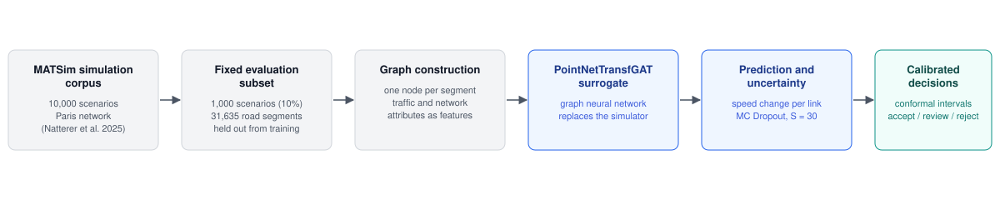
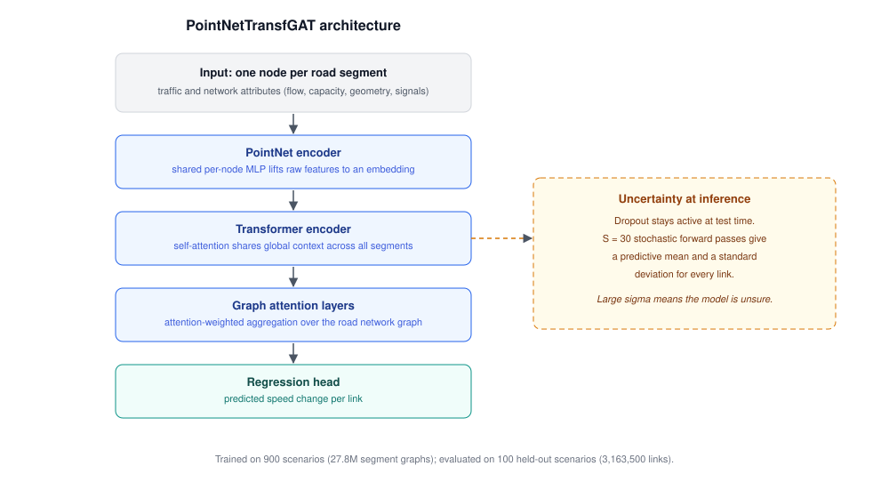
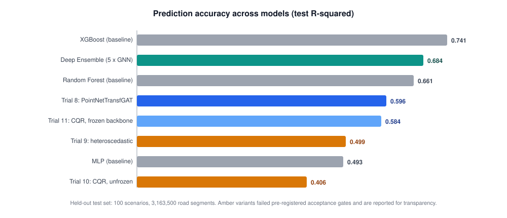
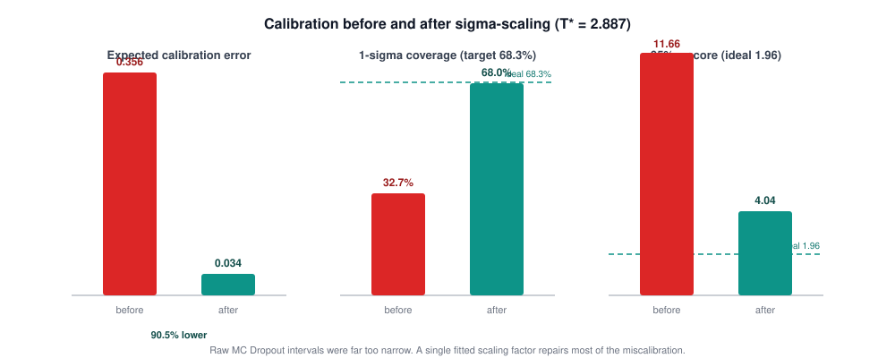
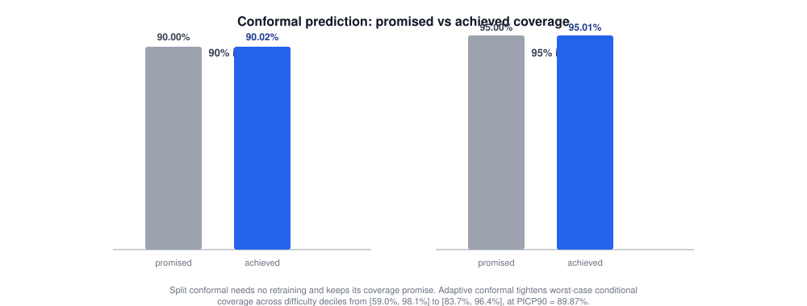
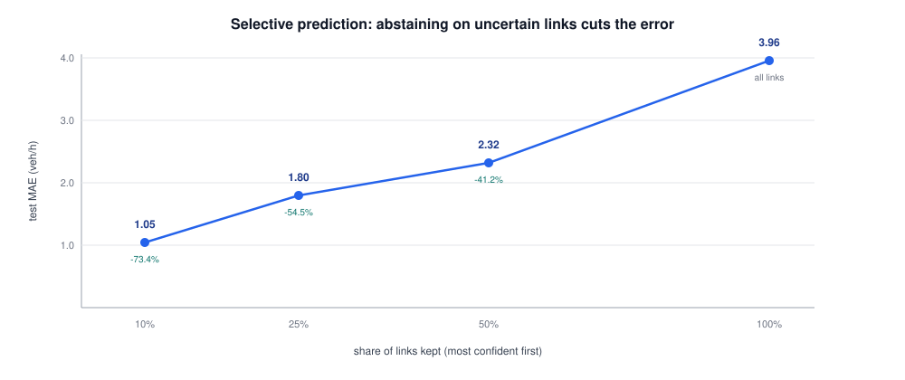
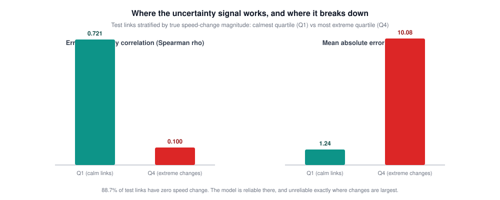

# Uncertainty Quantification for Machine Learning Models in Transportation Policy Analysis

Master's thesis, Technical University of Munich

| | |
|---|---|
| Author | Mohd Zamin Quadri |
| Degree | M.Sc. Mathematics in Science and Engineering |
| Department | Computer Science (Data Analytics and Machine Learning), School of CIT |
| Examiner | Prof. Dr. Stephan Gunnemann |
| Supervisors | Dominik Fuchsgruber, Elena Natterer |
| Submitted | May 15, 2026 |

The submitted thesis is [`document/main.pdf`](document/main.pdf). The full LaTeX source is in [`document/`](document/).

---

## What this thesis is about

City planners rely on large-scale traffic simulators such as MATSim to test policies before
anyone pours concrete. The problem is speed: a single simulation of a city like Paris can take
hours, so exploring thousands of "what if" questions is painful. A machine learning surrogate
that predicts simulation outcomes in milliseconds would change that, but only if planners know
when they can trust it. A surrogate that is confidently wrong is worse than no surrogate at all.

That is the gap this thesis works on. I took an existing corpus of 10,000 MATSim simulations of
Paris, trained a graph neural network to predict how policy scenarios change traffic speeds on
every road segment, and then spent most of the thesis answering the harder question: can the
model's uncertainty estimates be trusted, and can they be repaired when they cannot?

All experiments use a fixed, held-out subset of 1,000 scenarios (10 percent of the corpus,
covering Paris's 31,635 road segments) so that every method is compared on exactly the same
ground. The final test set is 100 scenarios, 3,163,500 road links, that no method ever trained on.



## The surrogate model

The surrogate is PointNetTransfGAT, a graph neural network that treats the road network as a
graph: one node per road segment, edges where segments connect. A PointNet-style encoder lifts
raw segment attributes into an embedding, a transformer encoder shares context across the whole
network, and graph attention layers aggregate information from neighbouring roads. The model
outputs a predicted speed change for every link.

For uncertainty I used MC Dropout: dropout stays active at inference time, and 30 stochastic
forward passes produce both a predictive mean and a standard deviation for each link. The hope is
that links where the model disagrees with itself are exactly the links where it is wrong.



## What the results show

The GNN surrogate (Trial 8) reaches R-squared 0.596 on the held-out test set, with a mean
absolute error of 3.96 veh/h. It does not beat XGBoost on raw accuracy (0.741), and the thesis
says so plainly. What the GNN offers instead is per-link uncertainty that a gradient-boosted
trees baseline does not provide, and a deep ensemble of five GNNs closes much of the accuracy
gap (0.684) at roughly five times the compute.



### The raw uncertainty is miscalibrated, and one fitted constant repairs most of it

Left alone, the MC Dropout intervals are far too narrow: a nominal 1-sigma band covers only
32.7 percent of errors instead of the expected 68.3 percent, and the expected calibration error
is 0.356. Fitting a single scalar (sigma-scaling, T* = 2.887) on a validation split cuts the
calibration error by 90.5 percent and brings 1-sigma coverage to 68.0 percent.



### Conformal prediction keeps its promise

Split conformal prediction wraps the model in intervals with a distribution-free coverage
guarantee, without retraining anything. On the test set the 90 percent intervals cover 90.02
percent and the 95 percent intervals cover 95.01 percent. The adaptive variant matters more in
practice: it tightens worst-case conditional coverage across difficulty deciles from a worrying
[59.0, 98.1] to [83.7, 96.4], so the guarantee degrades much more gracefully on hard scenarios.



### Uncertainty is useful for triage

The most practical result: if the model only answers on the links where it is most confident,
accuracy improves sharply. Keeping the most confident half of links cuts the error by 41
percent; keeping the most confident 10 percent cuts it by 73 percent. This is what makes the
accept / review / reject workflow in the thesis viable: confident predictions flow through,
uncertain ones get routed back to the full simulator.



## What did not work

The thesis reports failures alongside successes, because they are just as informative.

- **Heteroscedastic regression (Trial 9)** was meant to learn input-dependent noise directly.
  It failed the pre-registered accuracy gate (R-squared 0.499) and 99.85 percent of its
  predictive variance collapsed into the aleatoric term, so the epistemic signal was lost.
- **Conformalized quantile regression with an unfrozen backbone (Trial 10)** dropped accuracy to
  R-squared 0.406 and failed three of six acceptance gates. Freezing the backbone (Trial 11)
  recovered accuracy to 0.583 and passed all gates, but added nothing over split conformal.
- **Uncertainty quality collapses where it matters most.** On the calmest quartile of links the
  error-uncertainty correlation is a healthy 0.721; on the quartile with the largest speed
  changes it falls to 0.100, while the error grows eightfold. Since 88.7 percent of test links
  have no speed change at all, headline metrics flatter the model. The thesis states this
  limitation explicitly rather than hiding it.



## Repository layout

```
document/               The thesis itself
  main.pdf              Submitted version (May 15, 2026)
  main.tex, chapters/   LaTeX source, chapters 1-7 plus appendix
  pages/, figures/      Front matter and all thesis figures
  bibliography.bib
code/                   Everything needed to reproduce the analysis
  scripts/              data_preprocessing, gnn (models, losses), training, misc
  colab_*.ipynb         UQ master, verification, ensemble, scaling, RF baseline
  docs/                 Notes on preprocessing, the GNN, and training
  UQ_SUMMARY.md         Verified results summary (numbers cross-checked)
  environment-minimal.yml, traffic-gnn.yml
docs/diagrams/          SVG diagrams used in this README
```

## Data and model weights

The training data (about 4.8 GB of preprocessed graph batches) and the trained checkpoints
(about 6 GB) are not committed; they live locally. The underlying simulation corpus is by
Natterer et al. (2025), Transportation Research Part C 180:105360, and is not mine to
redistribute. Every headline number in this README was recomputed from the saved prediction
arrays during a pre-submission audit of all ten UQ methods, which found zero bugs.

## Reproducing the analysis

```bash
conda env create -f code/environment-minimal.yml
conda activate traffic-gnn
```

The notebooks under `code/` are the intended entry points: `colab_uq_master.ipynb` runs the
full UQ pipeline for the trained model, `colab_uq_verification.ipynb` recomputes the reported
metrics, and `colab_deep_ensemble_training.ipynb` and `colab_temperature_scaling.ipynb` cover
the ensemble and the calibration fit. Building the thesis PDF requires a LaTeX distribution;
`latexmk -pdf document/main.tex` is enough.

## Citation

```
Quadri, Mohd Zamin (2026). Uncertainty Quantification for Machine Learning Models
in Transportation Policy Analysis. Master's thesis, Technical University of Munich.
```

Supervised at the Professorship of Data Analytics and Machine Learning (Prof. Dr. Stephan
Gunnemann), Department of Computer Science, School of Computation, Information and Technology.
